# talculate

A programmer oriented tui calculator. simple keys. minimal ui.

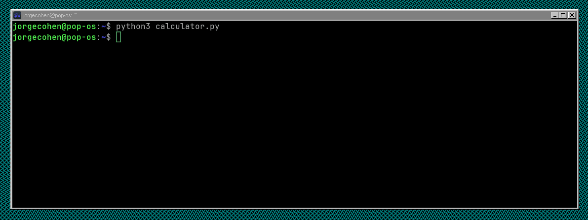

## Installations

The application has not been distributed as a package yet (WIP).
If you would like to use you need to clone it and follow the [setup guide](#setup).

### Arch

Soon

### NixOS

Soon

## Setup

### Poetry

The project utilizes [poetry](https://python-poetry.org/).

> [!NOTE]
>
> Poetry is available in project's development shell.
>
> If `direnv` is installed, you can use `direnv allow` inside the project directory instead of `nix develop`.

```sh
poetry install
poetry run talc
```

### Generic

> [!NOTE]
>
> Ensure that you create and source a virtual environment `python -m venv venv`
> to prevent the global installation of packages.
>
> [PEP 668](https://peps.python.org/pep-0668/)

```sh
pip install -r requirements.txt
python src/main.py
```

#### Using Make

```sh
make install_deps
make
```

#### Using Nix Development Shell

> [!NOTE]
>
> If `direnv` is installed, you can use `direnv allow` inside the project directory instead of `nix develop`.

```sh
nix --extra-experimental-features "nix-command flakes" develop
make install_deps
make
```

Run the calculator, type number, see results.

## Default Keybindings

- `q`: Quit
- `v`: Paste
- `c`: Copy selected value
- `l`: Copy line variable
- `tab`: Toggle focus between input and output
- `ctrl+x`: Toggle hexadecimal output
- `ctrl+b`: Toggle binary output

## Configuration

### Folder Location

The configuration files are located in:

#### Linux

The config files are located in XDG config home.

```sh
~/.config/talculate/
```

#### Windows

The config files are located in Local AppData.

```ps1
$env:LOCALAPPDATA\talculate
```

### Default Configuration

Values can be ommited but the keys cannot.
`config.yaml` uses default values when ommited.

```yaml
bindings:
  quit:
  paste:
  copy_selected:
  copy_line_var:
  toggle_focus:
  toggle_hex:
  toggle_binary:
theme:
```

### Themes

> [!NOTE]
>
> `textual-dark` is the default theme.
> You can use a pre-defined theme in the `config.yaml`.
>
> ```yaml
> theme: "name-of-theme"
> ```

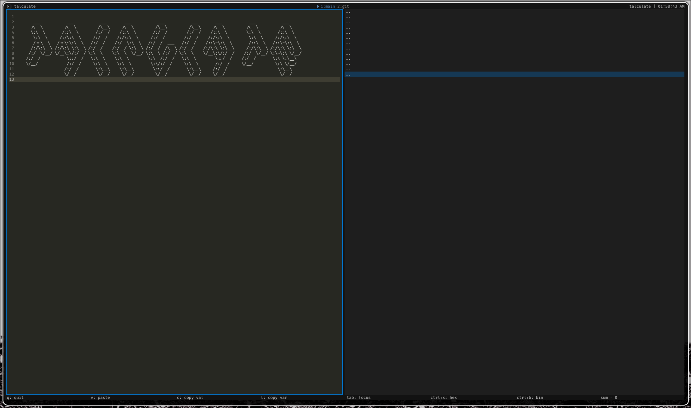
`textual-dark`

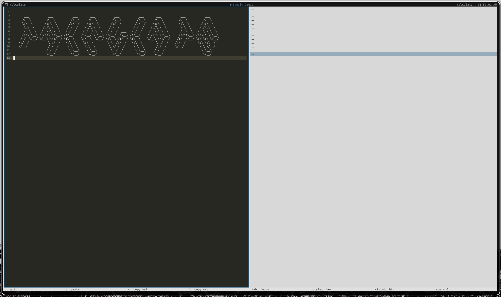
`textual-light`

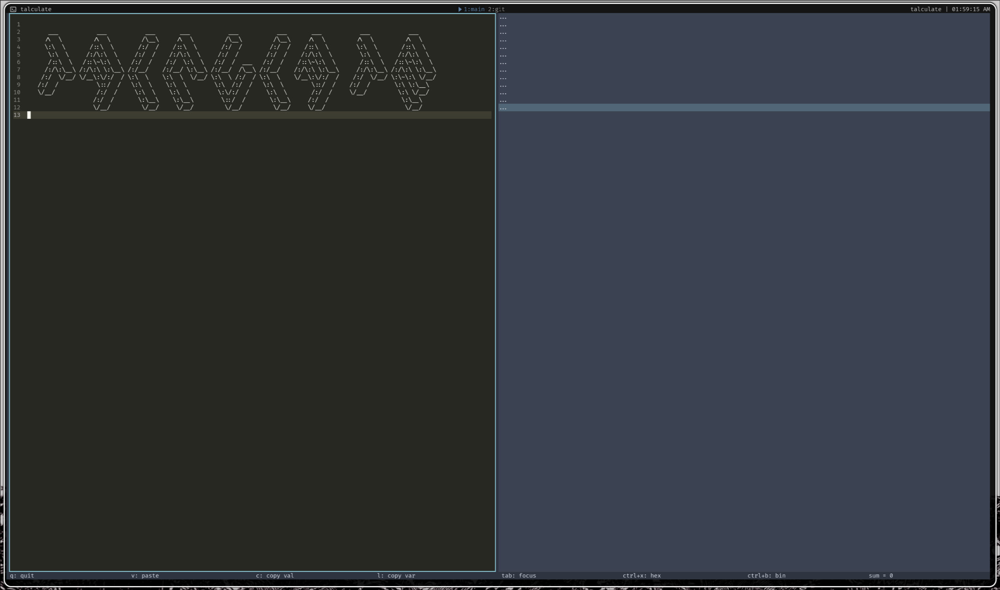
`nord`

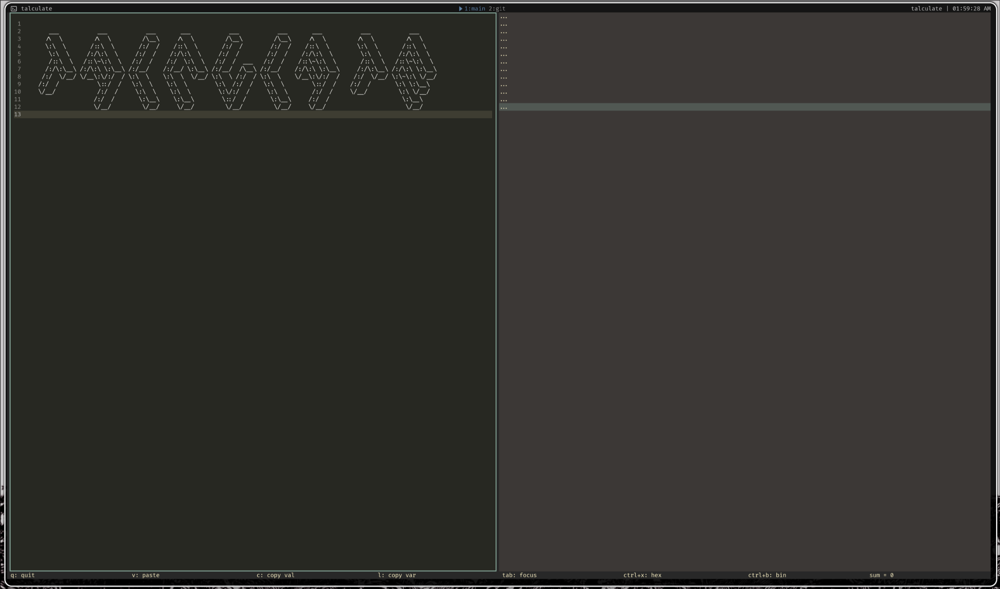
`gruvbox`

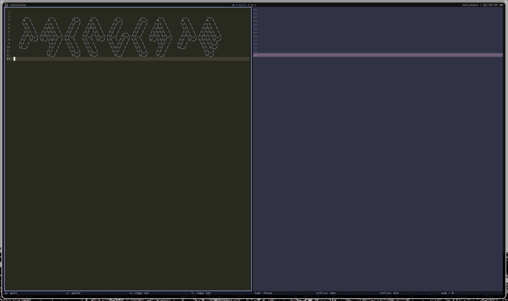
`gruvbox`

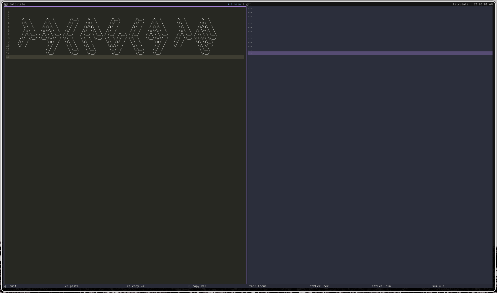
`dracula`

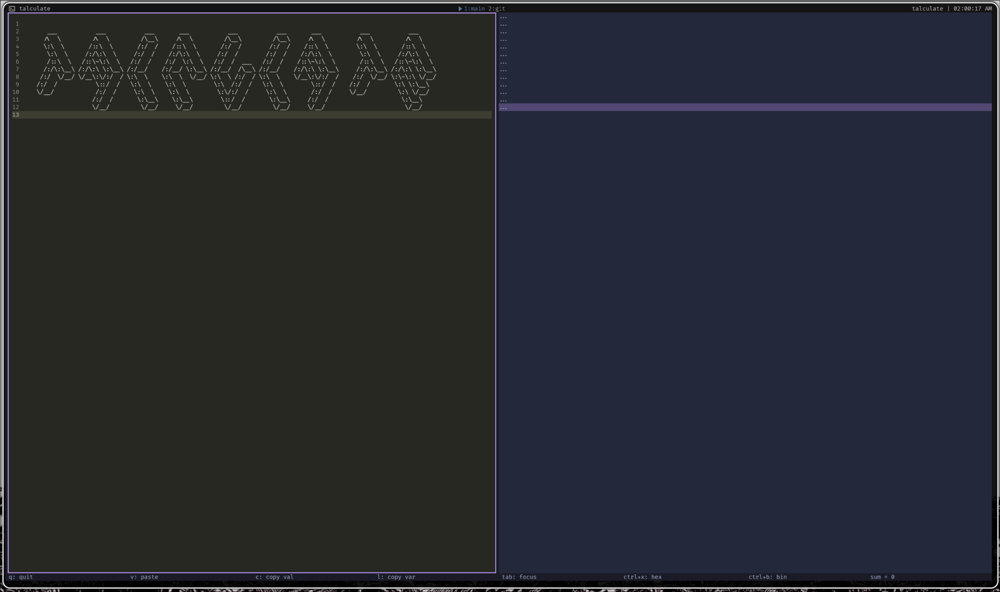
`tokyo-night`

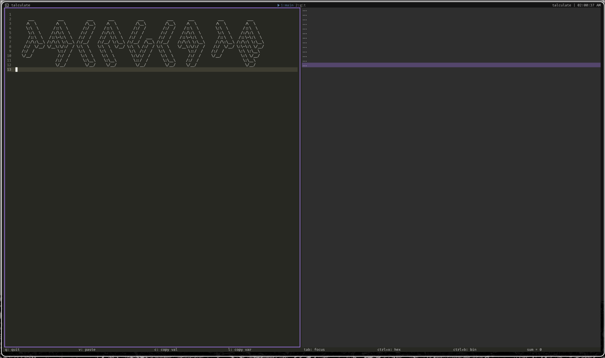
`monokai`

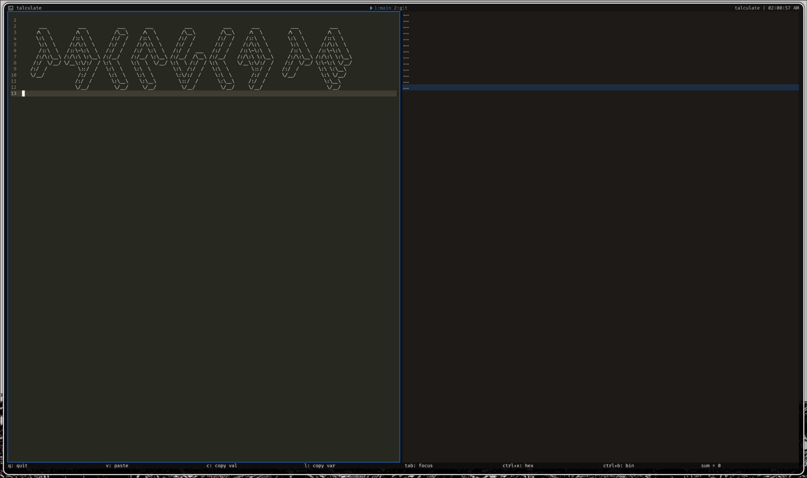
`flexoki`

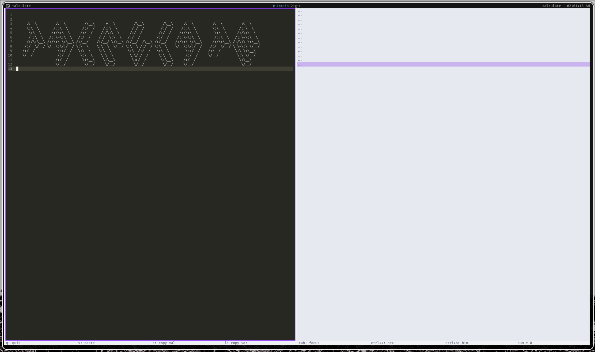
`catppuccin-latte`

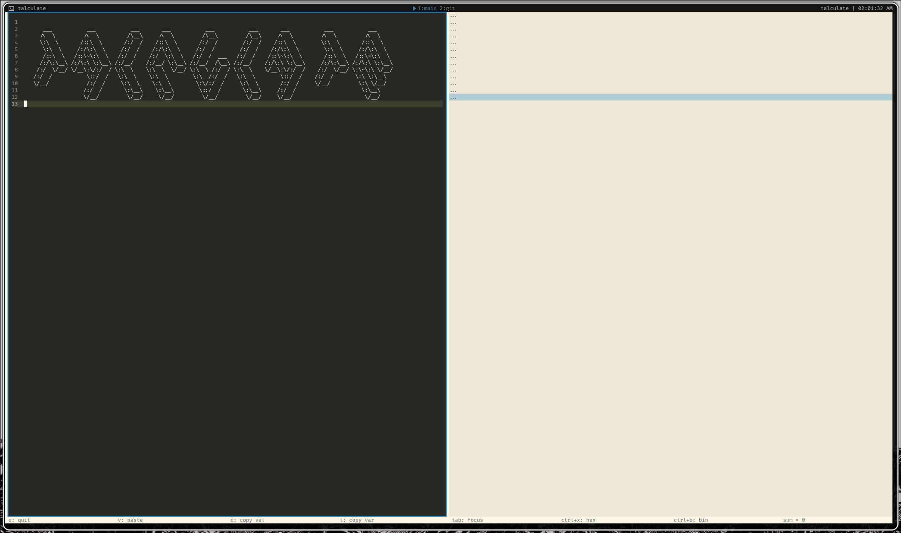
`solarized-light`

#### Custom Theme

If you want use a custom theme,
the name value in `theme.yaml` must match the theme value in `config.yaml`.

`theme.yaml`

```yaml
name: "custom-theme"
primary: "#00c0d0"
secondary: "#81A1C1"
accent: "#B48EAD"
foreground: "#D8DEE9"
background: "#2E3440"
success: "#A3BE8C"
warning: "#EBCB8B"
error: "#BF616A"
surface: "#3B4252"
panel: "#434C5E"
dark: true
footer-foreground: "#FFFFFF"
footer-background: "#000000"
```

`config.yaml`

```yaml
bindings:
  quit: "q"
  paste: "v"
  copy_selected: "c"
  copy_line_var: "l"
  toggle_focus: "tab"
  toggle_hex: "ctrl+x"
  toggle_binary: "ctrl+b"
theme: "custom-theme"
```
